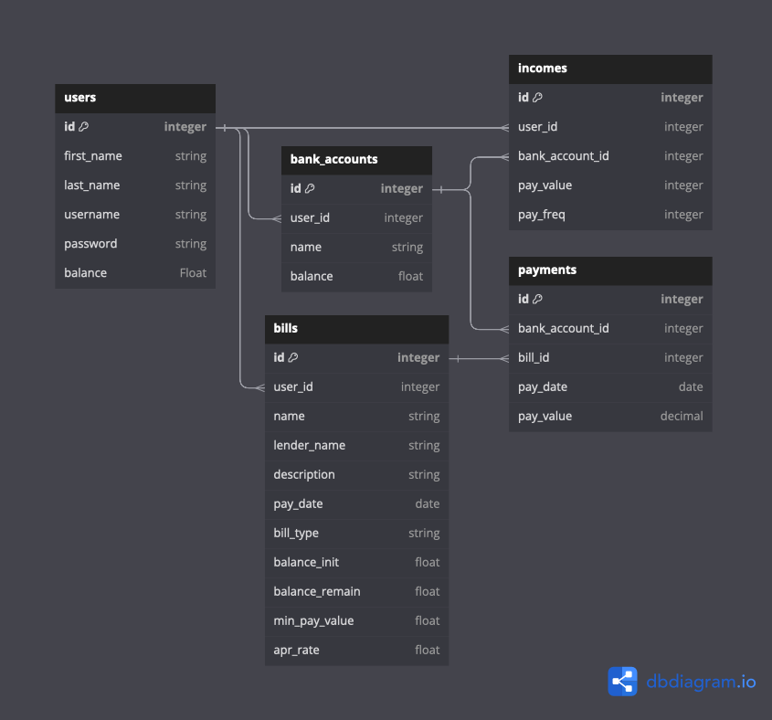

# CreditScape
<sup> Creator: Steven Mentzer </sup>

### Discover a financial management platform that offers you a panoramic view of your credit landscape, guiding your journey through credit cards, loans, and mortgage payments with ease.

Transform your finances with a dynamic and interactive payment strategy. Integrate a versatile payment plan encompassing all your bills, tailored to your needs. List all your bank accounts, providing an insightful overview of your financial reservoir as your various income sources and scheduled payments traverse through it. Incorporate your monthly expenses, spanning from mortgage payments to grocery allocations, to ensure comprehensive coverage. Visualize your daily bank balance, empowering you to meticulously plan your expenditures and identify surplus funds to accelerate debt repayment while evading unnecessary interest charges. With this enhanced approach, you'll navigate your financial landscape with confidence, swiftly eliminating debts and fostering financial stability.


## Installation Instructions

1. Fork and clone Git repository
2. Navigate to base directory in your terminal and run the following code: 

    ```insert instructions```
   
    ```insert instructions```

    ```insert instructions```

4. Enjoy the program!

## Backend (API)
### Model Relationships
#### One to Many - User to Bills, Banks, and Incomes
* A `User` has many `Bills`, `Banks`, and `Incomes`
* A `User` has many `Payments` through `Bills` and `Banks`
* A `Bill` belongs to a `User`
* A `Bank` belongs to a `User`
* A `Income` belongs to a `User`

#### Many to Many - Bills and Banks to Payments
* A `Bill` has many `Payments` through the payments table.
* A `Bank` has many `Payments` through the payments table.
* A `Payment` belongs to `Bill` and `Bank`

### Model Validations

#### Users
* `first_name` and `last_name` must be Strings under 20 characters
* `username` must be 7-20 characters and not already exist
* `password` must be 7-20 characters and include one `['!','@','#','$','%','^','&','*','(',')']`

#### Banks
* `name` is a String under 20 characters
* `balance` must be a positive Float

#### Incomes
* `pay_value` must be greater than 0
* `pay_freq` must be between 1-4 (payouts per month)

#### Bills
* `name` is String under 20 characters
* `lender_name` is an optional String less than 20 characters
* `description` is an optional String less than 50 characters
* `bill_type`, and `pay_date` must exist
* `balance_init`, `balance_remain`, and `min_pay_value` must all be positive Floats
* `apr_rate` must be a positive float between 0-100, with a max of two decimal points

#### Payments
* `pay_value` must be a Decimal(?)

## Controllers
### API routes RESTful conventions
#### Users
```
    GET/users
    POST/users
```
```
    GET/user/<int:id>
    PATCH/user/<int:id>
    DELETE/user/<int:id>
```
#### Bills
```
    GET/bills
    POST/bills
```
```
    GET/bill/<int:id>
    PATCH/bill/<int:id>
    DELETE/bill/<int:id>
```
#### Banks
```
    GET/banks
    POST/banks
```
```
    GET/bank/<int:id>
    PATCH/bank/<int:id>
    DELETE/bank/<int:id>
```
#### Incomes
```
    GET/incomes
    POST/incomes
```
```
    GET/income/<int:id>
    PATCH/income/<int:id>
    DELETE/income/<int:id>
```
#### Payments
```
    GET/payments
    POST/payments
```
```
    GET/payment/<int:id>
    PATCH/payment/<int:id>
    DELETE/payment/<int:id>
```
## Data Flow Visualizations

 ### ORD Database Table: 
 The entity relationship database is illustrated here: 




 ### Front End Design Schema: 
 The command line interface has a structured user iterface flow: 

https://www.figma.com/file/7xG34iBgHUY9qWnEbleQJg/Untitled?type=whiteboard&node-id=0%3A1&t=eLtOtzlE8pjkfg0n-1

## Technologies Used

- **Python**: The primary language used for backend development.
- **Flask**: A micro web framework written in Python.
- **React**: A JavaScript library for building user interfaces.
- **REST APIs**: Handles requests and responses between the client and server.
- **SQLAlchemy**: An SQL toolkit and Object-Relational Mapping (ORM) for Python.
- **Dbdiagram.io**: An ORD visualization software
